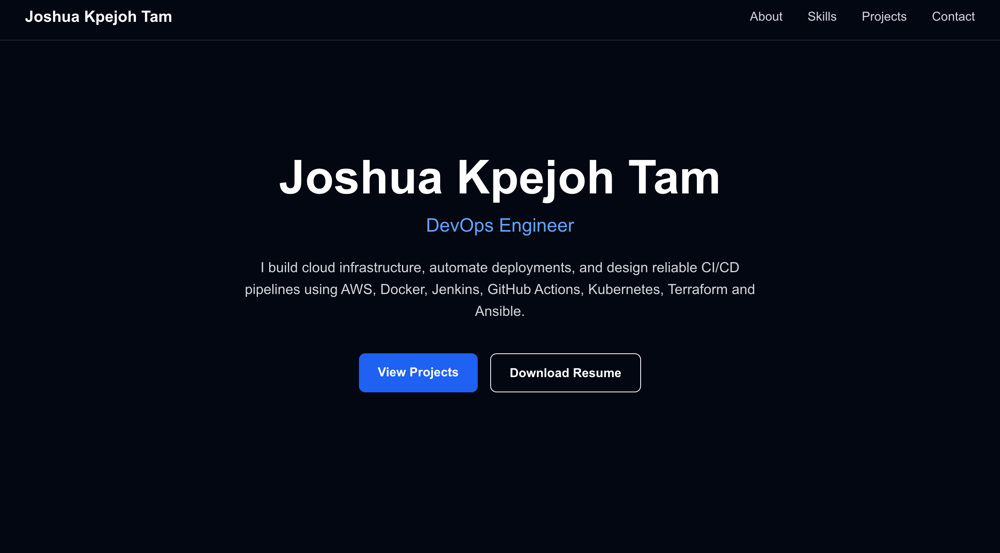
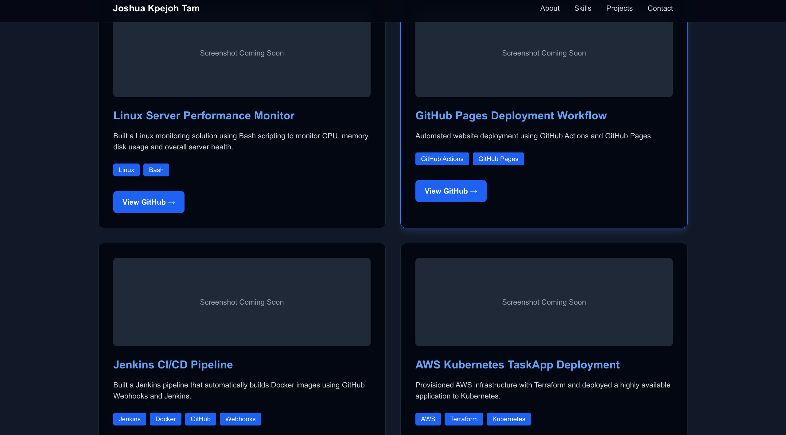
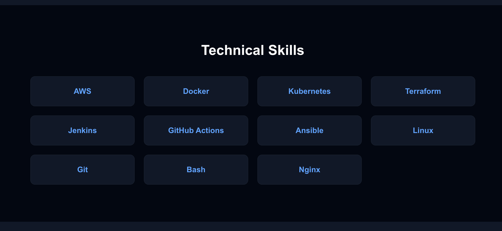
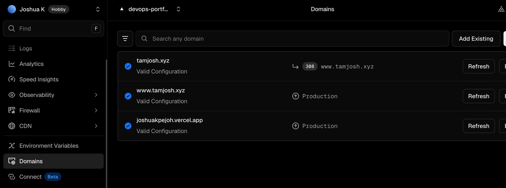

# DevOps Portfolio


A modern DevOps portfolio built with **Next.js**, showcasing my cloud engineering, DevOps, and automation projects. The portfolio is deployed on **Vercel** and served through a custom domain with DNS configuration.

---

## 🌐 Live Demo

**Website:** https://tamjosh.xyz

---

## 📖 Overview

This portfolio highlights my hands-on DevOps projects and technical experience in:

- Linux System Administration
- Bash Scripting
- Git & GitHub
- Docker
- Kubernetes
- Terraform
- Jenkins
- CI/CD Pipelines
- Cloud Infrastructure
- DNS Configuration
- Next.js Deployment with Vercel

The website is fully responsive and designed to showcase my work to recruiters, hiring managers, and potential collaborators.

---

## ✨ Features

- Responsive design
- Modern UI built with Next.js
- Professional project showcase
- Resume download
- Contact section
- Custom domain configuration
- Automatic deployments with GitHub and Vercel
- Optimized for desktop and mobile devices

---

## 🛠️ Tech Stack

### Frontend

- Next.js
- React
- TypeScript
- Tailwind CSS

### DevOps

- Linux
- Bash
- Git
- GitHub
- Docker
- Kubernetes
- Terraform
- Jenkins
- Vercel
- DNS Configuration

---

## 🚀 Featured Projects

### 🐧 Linux Monitoring Server

A Linux monitoring solution built with Bash scripting and Linux system utilities.

**Highlights**

- Automated server health monitoring
- CPU usage reporting
- Memory usage reporting
- Disk space monitoring
- Process monitoring
- Bash automation

---

### ⚙️ Jenkins CI/CD Automation

Built a Jenkins pipeline to automate application builds and Docker image creation.

**Highlights**

- Jenkins pipeline automation
- Docker image builds
- Source code integration with GitHub
- Continuous Integration workflow

---

### ☸️ Kubernetes Capstone Project

Provisioned cloud infrastructure and deployed a containerized application using Terraform and Kubernetes.

**Highlights**

- Infrastructure as Code using Terraform
- Kubernetes deployment
- Cloud networking
- Container orchestration
- Production-ready infrastructure

---

## 📸 Screenshots

### Homepage



### Projects



### Skills



### Contact


---

## 📁 Project Structure

```text
devops-portfolio/
│
├── app/
├── components/
├── public/
│   └── images/
├── README.md
├── package.json
├── next.config.ts
└── tsconfig.json
```

---

## ⚙️ Installation

Clone the repository:

```bash
git clone https://github.com/Joshpanamera/devops-portfolio.git
```

Navigate into the project:

```bash
cd devops-portfolio
```

Install dependencies:

```bash
npm install
```

Run the development server:

```bash
npm run dev
```

Open your browser and visit:

```text
http://localhost:3000
```

---

## 🌍 Deployment

The application is deployed on **Vercel**.

Every push to the **main** branch automatically triggers a new production deployment.

Production URL:

https://tamjosh.xyz

---

## 🔮 Future Improvements

- Add GitHub Actions CI workflow
- Integrate automated Jenkins deployments
- Add Terraform architecture diagrams
- Add Kubernetes deployment manifests
- Improve project filtering
- Expand project portfolio

---

## 📫 Contact

**Website**

https://tamjosh.xyz

**GitHub**

https://github.com/Joshpanamera

**LinkedIn**

Coming Soon

---

## 📄 License

This project is licensed under the MIT License.
